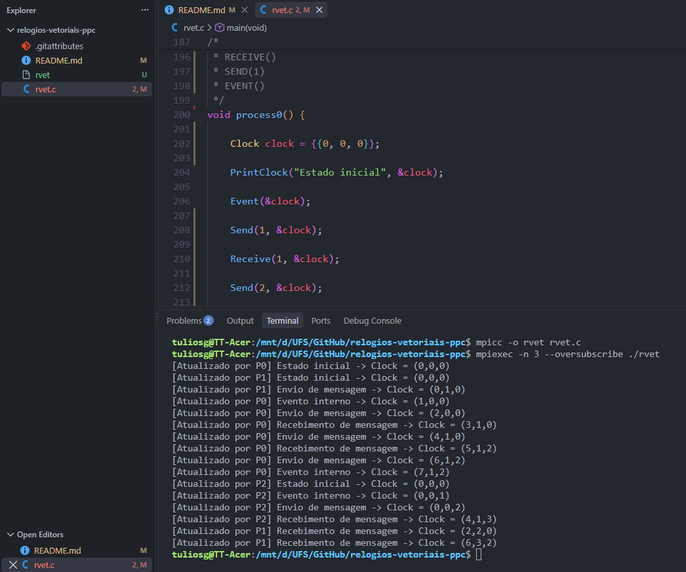

# Projeto de Programação Paralela e Concorrente - Etapa 1
## Implementação de Relógios Vetoriais

> Discente: Túlio Sousa de Gois  
> Matrícula: 202000024599

## Execução do código
1. Compile o `rvet.c`:
```
mpicc -o rvet rvet.c
```

2. Execute:
```
mpiexec -n 3 --oversubscribe ./rvet
```

### Resultado
Figura 1. Resultado da execução

